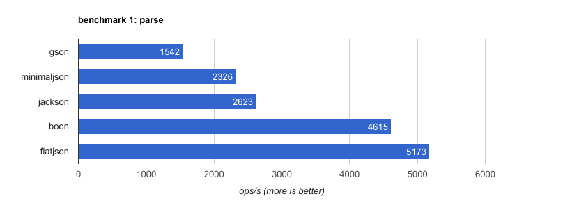
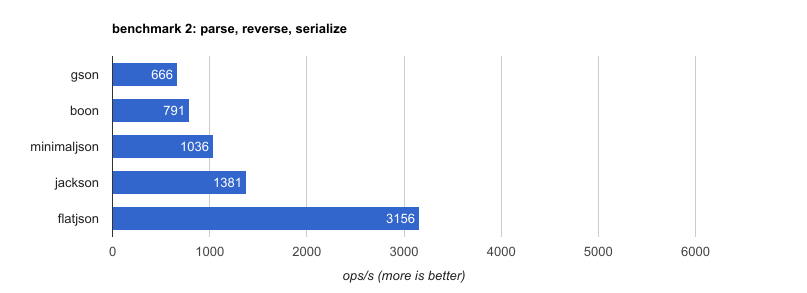

# flatjson

A fast [json](https://json.org) parser (and builder), written in java.


*photo: [yoann supertramp](https://500px.com/photo/172664473/) [CC-BY]*

* [Features](#features)
* [Performance](#performance)
* [Installation](#installation)
* [Usage](#usage)
* [Contributing](#contributing)
* [History](#history)
* [License](#license)

### Features

* **efficient** &mdash; allocates as few objects as possible
* **easy to use** &mdash; simple api, inspired by [minimal-json](https://github.com/ralfstx/minimal-json)
* **fast** &mdash; like a bat out of hell!


### Performance

the following chart shows benchmark results for parsing a 72K sample file on my macbook pro (2,7 ghz intel core i5).



flatjson outperforms some popular json parsers (gson, jackson) by 2x to 3x, and is even faster than boon (which is known to be pretty fast).

normally, we want to do something with json, once we've parsed it. the second benchmark simulates an event processing use case: parse the event, process the data (= reverse an array which makes up the bulk of the json document), then serialize the result back to a string.



as the graph shows, flatjson shines even more here.

you can run these benchmark yourself with `./gradlew jmh` &mdash; a full run takes a bit over an hour.


#### So, what's the trick?

flatjson does not build a parse tree, just an index overlay, which is stored in an integer array. json nodes are constructed on demand (= on first access). this way, lots of objects allocations are saved.

when serializing json, flatjson handles unchanged subtrees by copying substrings directly from input to output, bypassing actual serialization as much as possible.

### Installation

flatjson is on Maven Central, simply add it as a gradle dependency:

```
compile 'org.zalando:flatjson:1.1.0'
```

### Usage

```java
Json json = Json.parse("[42, true, \"hello\"]");
```

we can check which type of entity the returned `Json` object represents:

```java
json.isNumber(); // --> false
json.isObject(); // --> false
json.isArray(); // --> true
```
for each `isFoo` method, there is a matching `asFoo` accessor.
arrays are represented by lists of `Json` objects.

```java
List<Json> array = json.asArray();
array.size(); // --> 3
array.get(0).asLong(); // --> 42
array.get(1).asBoolean(); // --> true
array.get(2).asString(); // --> "hello"
```
this list is mutable and allows manipulation of the json DOM:

```java
array.add(Json.value(false));
json.toString(); // --> "[42,true,\"hello\",false]"
```
you can also build objects from scratch:

```java
Json test = Json.object();
Map<String, Json> object = test.asObject();
object.put("color", Json.value("blue"));
object.put("size", Json.value(39));
test.toString(); // --> "{\"color\":\"blue\",\"size\":39}"
```
same with arrays:

```java
Json test = Json.array();
List<Json> array = test.asArray();
array.add(Json.value("hello"));
array.add(Json.value(42));
test.toString(); // --> "[\"hello\",42]"

```

### Contributing

contributions are welcome &mdash; especially 

* reporting bugs
* running the benchmarks in different environments (AMD, Azure, AWS, Google Cloud ...) and sharing the [results](benchmarks.txt)
* adding your favorite json parser to the benchmarks &mdash; can it beat flatjson?
* adding more unit tests.

i will not easily be persuaded to merge in major new features, though.


### History

##### 1.1.0 &mdash; 2017-04-03
* implemented `Visitor` pattern to interact with json
* added `json.prettyPrint()` (implemented as `Visitor`)
* `json.equals()` now based on `json.prettyPrint()`

##### 1.0.1 &mdash; 2017-03-17
* support additional number types: `int`, `float`, `BigInteger`, `BigDecimal`

##### 1.0 &mdash; 2017-03-10
* initial public release


### License

```
The MIT License (MIT)

Copyright (c) 2017 Zalando SE

Permission is hereby granted, free of charge, to any person obtaining a copy
of this software and associated documentation files (the "Software"), to deal
in the Software without restriction, including without limitation the rights
to use, copy, modify, merge, publish, distribute, sublicense, and/or sell
copies of the Software, and to permit persons to whom the Software is
furnished to do so, subject to the following conditions:

The above copyright notice and this permission notice shall be included in
all copies or substantial portions of the Software.

THE SOFTWARE IS PROVIDED "AS IS", WITHOUT WARRANTY OF ANY KIND, EXPRESS OR
IMPLIED, INCLUDING BUT NOT LIMITED TO THE WARRANTIES OF MERCHANTABILITY,
FITNESS FOR A PARTICULAR PURPOSE AND NONINFRINGEMENT. IN NO EVENT SHALL THE
AUTHORS OR COPYRIGHT HOLDERS BE LIABLE FOR ANY CLAIM, DAMAGES OR OTHER
LIABILITY, WHETHER IN AN ACTION OF CONTRACT, TORT OR OTHERWISE, ARISING FROM,
OUT OF OR IN CONNECTION WITH THE SOFTWARE OR THE USE OR OTHER DEALINGS IN
THE SOFTWARE.
```

