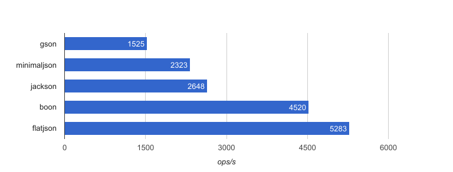

# flatjson

A fast [json](https://json.org) parser (and builder), written in java.


### Features

* **memory-efficient** &mdash; allocates as few objects as possible
* **easy to use** &mdash; simple api, inspired by [minimal-json](https://github.com/ralfstx/minimal-json)
* **fast** &mdash; like a bat out of hell!


### Performance

the following chart shows benchmark results for parsing a 72K sample file on my macbook pro (2,7 ghz intel core i5).



flatjson outperforms some popular json parsers (gson, jackson) by 2x to 3x, and is even faster than boon (which is known to be pretty fast).

you can run this benchmark yourself with `gradle jmh`.


### So, what's the secret?

flatjson does not build a parse tree, but just a parse index ("overlay"), which is stored in an integer array. json nodes are constructed on demand (= on first access). this way, thousands of objects allocations are saved.

flatjson is best suited for cases where the full json document is not used, only parts of it.

### Usage

```java
Json json = Json.parse("[42, true, \"hello\"]");
```

we can check which type of entity the `Json` object represents:

```java
json.isNumber(); // --> false
json.isObject(); // --> false
json.isArray(); // --> true
```
for each `isFoo` method, there is a matching `asFoo` accessor.
arrays are represented by lists of `Json` objects.

```java
List<Json> array = json.asArray();
array.size(); // --> 3
array.get(0).asLong(); // --> 42
array.get(1).asBoolean(); // --> true
array.get(2).asString(); // --> "hello"
```
this list is mutable and allows manipulation of the json DOM:

```java
array.add(Json.value(false));
json.toString(); // --> [42, true, "hello", false]
```
there are builder methods for arrays and objects as well:

```java
Json test = Json.object();
Map<String, Json> object = test.asObject();
object.put("color", Json.value("blue"));
object.put("size", Json.value(39));
test.toString(); // --> {"color":"blue","size":39}

```

### License

[MIT](LICENSE.txt)


